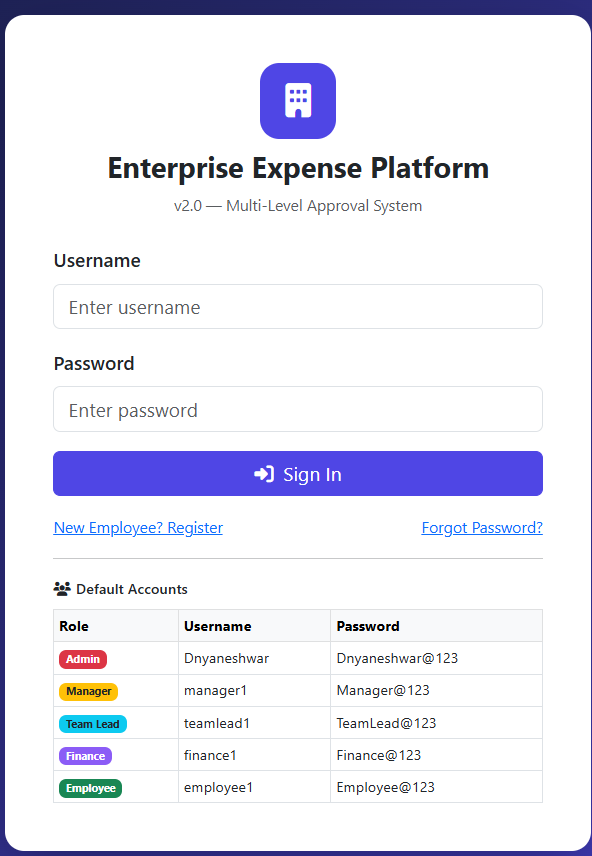
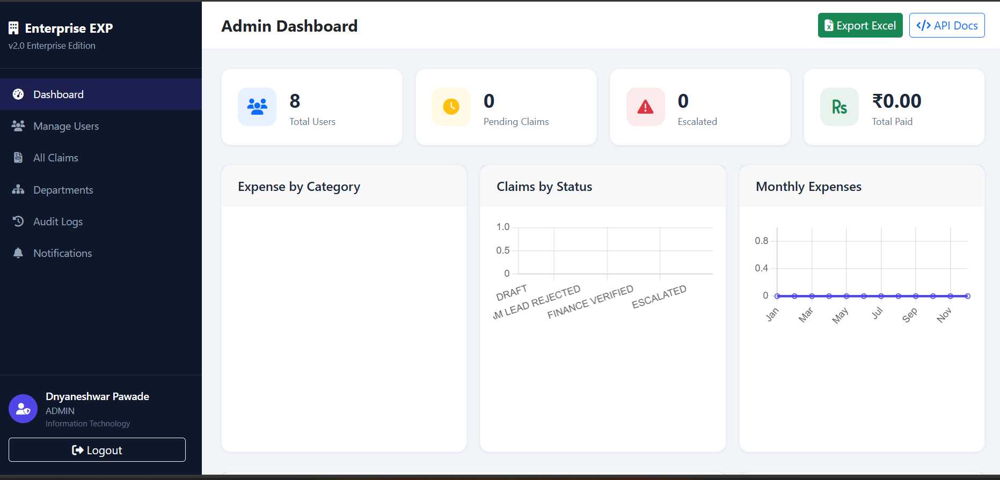

# 💼 Employee Expense Reimbursement System
### Enterprise Expense Management Platform v2.0

[](https://www.java.com)
[](https://spring.io/projects/spring-boot)
[](https://www.mysql.com)
[](#)

A full-stack **Spring Boot + MySQL + HTML/CSS/JS** enterprise-grade expense reimbursement system with **multi-level approval workflow**, **6 roles**, **SLA tracking**, **JWT authentication**, **PDF/Excel export**, and **real-time notifications**.

---

## 🌐 Live Demo
> Start the app and open: **http://localhost:8082**

### 🔑 Quick Login
| Role | Username | Password |
|------|----------|----------|
| Admin | `Dnyaneshwar` | `Dnyaneshwar@123` |
| Manager | `manager1` | `Manager@123` |
| Team Lead | `teamlead1` | `TeamLead@123` |
| Finance | `finance1` | `Finance@123` |
| Employee | `employee1` | `Employee@123` |

---

## 📸 Screenshots

> Login Page → Dashboard → Submit Expense → Approval Workflow → Analytics

### Login Page


### Admin Dashboard


---

## 🚀 Tech Stack

| Layer | Technology |
|-------|-----------|
| Backend | Java 17, Spring Boot 3.2.0 |
| Security | Spring Security, JWT (jjwt 0.11.5) |
| Database | MySQL 8, Spring Data JPA / Hibernate |
| Frontend | HTML5, CSS3, Bootstrap 5.3, Chart.js |
| Export | iTextPDF, Apache POI (Excel) |
| API Docs | SpringDoc OpenAPI (Swagger UI) |
| Scheduler | Spring Task Scheduling |
| Build | Maven |

---

## 📁 Project Structure

```
enterprise-expense-platform/
├── src/main/java/com/enterprise/expense/
│   ├── config/
│   │   ├── DataInitializer.java       # Creates default users & departments on startup
│   │   ├── SecurityConfig.java        # JWT security, CORS, role-based URL protection
│   │   └── SwaggerConfig.java         # OpenAPI / Swagger configuration
│   ├── controller/
│   │   ├── AuthController.java        # Login, Register, Forgot/Reset Password, Refresh Token
│   │   ├── ExpenseController.java     # Submit, view, search expense claims
│   │   ├── TeamLeadController.java    # Team Lead approval actions
│   │   ├── ManagerController.java     # Manager approval actions
│   │   ├── FinanceController.java     # Finance verification & payment processing
│   │   ├── AdminController.java       # Admin dashboard, users, departments, charts
│   │   ├── NotificationController.java# Get & mark notifications
│   │   ├── CommentController.java     # Add & view comments on claims
│   │   ├── UserController.java        # View & update profile
│   │   └── ExportController.java      # PDF & Excel export
│   ├── dto/                           # Request/Response data transfer objects
│   ├── entity/                        # JPA entities (12 tables)
│   ├── enums/                         # Role, ClaimStatus, ExpenseCategory, ApprovalAction
│   ├── exception/                     # Global exception handler
│   ├── repository/                    # Spring Data JPA repositories (11 repos)
│   ├── scheduler/
│   │   └── SlaScheduler.java          # Hourly SLA breach check, monthly reminders
│   ├── security/                      # JWT filter, token provider, UserDetails
│   └── service/                       # Business logic (7 services)
├── src/main/resources/
│   ├── static/
│   │   ├── index.html                 # Login page
│   │   ├── forgot-password.html       # Forgot / Reset password
│   │   ├── html/                      # All role dashboards & pages (16 pages)
│   │   ├── css/style.css              # Global styles
│   │   └── js/
│   │       ├── api.js                 # Axios-like API client with auto token refresh
│   │       ├── app.js                 # Shared utilities
│   │       └── login.js               # Login page logic
│   └── application.properties
└── pom.xml
```

---

## 👥 Roles & Permissions

| Role | Description |
|------|-------------|
| **ADMIN** | Full access — manage users, departments, all claims, audit logs, charts |
| **MANAGER** | Approve/reject claims after Team Lead, view department reports |
| **TEAM_LEAD** | First-level approval of employee claims |
| **FINANCE** | Verify approved claims, process payments |
| **EMPLOYEE** | Submit expense claims, track status, view history |
| **AUDITOR** | Read-only access to all claims and audit logs |

---

## 🔄 Multi-Level Approval Workflow

```
Employee Submits Claim
        ↓
  Team Lead Reviews  →  Rejected
        ↓ Approved
  Manager Reviews    →  Rejected
        ↓ Approved
  Finance Verifies   →  Rejected
        ↓ Verified
  Finance Processes Payment
        ↓
     PAID ✅
```

### Claim Statuses (11 total)
`DRAFT` → `PENDING_TEAM_LEAD` → `PENDING_MANAGER` → `PENDING_FINANCE` → `VERIFIED` → `PAYMENT_PROCESSING` → `PAID`

Also: `REJECTED_BY_TEAM_LEAD`, `REJECTED_BY_MANAGER`, `REJECTED_BY_FINANCE`, `CANCELLED`

---

## 🗄️ Database Schema (12 Tables)

| Table | Description |
|-------|-------------|
| `users` | All user accounts with roles |
| `departments` | Company departments |
| `expense_claims` | Main expense claim records |
| `approval_history` | Full audit trail of every approval action |
| `claim_documents` | Attached receipts/files |
| `comments` | Comments on claims |
| `payments` | Payment records |
| `notifications` | In-app notifications |
| `audit_logs` | System-wide audit logs |
| `sla_tracking` | SLA breach tracking per claim |
| `refresh_tokens` | JWT refresh tokens |
| `expense_category_config` | Category-wise limits & configs |

---

## 🔐 Authentication

- **JWT Access Token** — expires in 24 hours
- **Refresh Token** — expires in 7 days, auto-refreshes in frontend
- **BCrypt** password encoding
- **Forgot Password** — generates a reset token (displayed on screen in dev mode)

---

## 📊 Expense Categories (12 types)

`TRAVEL` · `ACCOMMODATION` · `MEALS` · `OFFICE_SUPPLIES` · `EQUIPMENT` · `SOFTWARE` · `TRAINING` · `MEDICAL` · `COMMUNICATION` · `ENTERTAINMENT` · `MAINTENANCE` · `OTHER`

---

## ⏱️ SLA Tracking

- Claims not approved within **48 hours** → SLA breach flagged
- Claims not resolved within **72 hours** → Auto-escalated to Manager
- Scheduler runs **every hour** to check breaches
- **Monthly reminder emails** sent to employees with pending claims

---

## 📄 Export Features

- **PDF** — Individual claim PDF with full details
- **Excel** — My claims export / All claims export (Admin)

---

## 🖥️ Frontend Pages (18 pages)

| Page | Role |
|------|------|
| `index.html` | Login |
| `forgot-password.html` | All |
| `register.html` | New employees |
| `employee-dashboard.html` | Employee |
| `submit-expense.html` | Employee |
| `my-claims.html` | Employee |
| `teamlead-dashboard.html` | Team Lead |
| `manager-dashboard.html` | Manager |
| `finance-dashboard.html` | Finance |
| `admin-dashboard.html` | Admin (with Chart.js graphs) |
| `admin-users.html` | Admin |
| `admin-claims.html` | Admin |
| `admin-departments.html` | Admin |
| `audit-logs.html` | Admin / Auditor |
| `auditor-dashboard.html` | Auditor |
| `notifications.html` | All |
| `profile.html` | All |
| `payment-history.html` | Finance / Admin |

---

## ⚙️ Setup & Installation

### Prerequisites
- Java 17+
- MySQL 8+
- Maven 3.6+

### 1. Clone the repository
```bash
git clone https://github.com/Dnyanu-Pawade/Employee-Expense-Reimbursement-System.git
cd Employee-Expense-Reimbursement-System
```

### 2. Create MySQL Database
```sql
CREATE DATABASE enterprise_expense;
```

### 3. Configure application.properties
```properties
spring.datasource.url=jdbc:mysql://localhost:3306/enterprise_expense
spring.datasource.username=root
spring.datasource.password=your_mysql_password
```

### 4. Build & Run
```bash
mvn clean package -DskipTests
java -jar target/enterprise-expense-platform-2.0.0.jar
```

### 5. Open in browser
```
http://localhost:8082
```

---

## 👤 Default Login Accounts

| Role | Username | Password |
|------|----------|----------|
| Admin | `Dnyaneshwar` | `Dnyaneshwar@123` |
| Manager | `manager1` | `Manager@123` |
| Team Lead | `teamlead1` | `TeamLead@123` |
| Finance | `finance1` | `Finance@123` |
| Employee | `employee1` | `Employee@123` |

> All default accounts are created automatically on first startup via `DataInitializer.java`

---

## 📡 API Endpoints

| Method | Endpoint | Access |
|--------|----------|--------|
| POST | `/api/auth/login` | Public |
| POST | `/api/auth/register` | Public |
| POST | `/api/auth/forgot-password` | Public |
| POST | `/api/auth/reset-password` | Public |
| POST | `/api/auth/refresh-token` | Public |
| GET/POST | `/api/expenses/**` | Authenticated |
| PUT | `/api/team-lead/approve/{id}` | Team Lead |
| PUT | `/api/manager/approve/{id}` | Manager |
| PUT | `/api/finance/verify/{id}` | Finance |
| POST | `/api/finance/payment/{id}` | Finance |
| GET | `/api/admin/dashboard` | Admin |
| GET | `/api/admin/users` | Admin |
| GET | `/api/export/claim/{id}/pdf` | Authenticated |
| GET | `/api/export/all-claims/excel` | Admin/Finance |

> Full API docs available at: `http://localhost:8082/swagger-ui.html`

---

## 🔧 Configuration

| Property | Default | Description |
|----------|---------|-------------|
| `server.port` | `8082` | App port |
| `jwt.expiration` | `86400000` | Access token TTL (24h) |
| `jwt.refresh-expiration` | `604800000` | Refresh token TTL (7d) |
| `sla.approval.hours` | `48` | Hours before SLA breach |
| `sla.escalation.hours` | `72` | Hours before escalation |
| `spring.servlet.multipart.max-file-size` | `10MB` | Max upload size |

---

## 📬 Email Configuration (Optional)

To enable real email notifications, update `application.properties`:
```properties
spring.mail.host=smtp.gmail.com
spring.mail.port=587
spring.mail.username=your_email@gmail.com
spring.mail.password=your_app_password
```
> Without email config, the forgot-password reset token is displayed directly on screen.

---

## 📦 Key Dependencies

```xml
spring-boot-starter-web
spring-boot-starter-security
spring-boot-starter-data-jpa
spring-boot-starter-mail
spring-boot-starter-actuator
jjwt-api 0.11.5
itextpdf 5.5.13.3
poi-ooxml 5.2.3 (Apache POI)
springdoc-openapi-starter-webmvc-ui 2.3.0
mysql-connector-j
lombok
```

---

## 🌐 Health Check

```
http://localhost:8082/actuator/health
```

---

*Built with ❤️ using Spring Boot 3.2.0*
